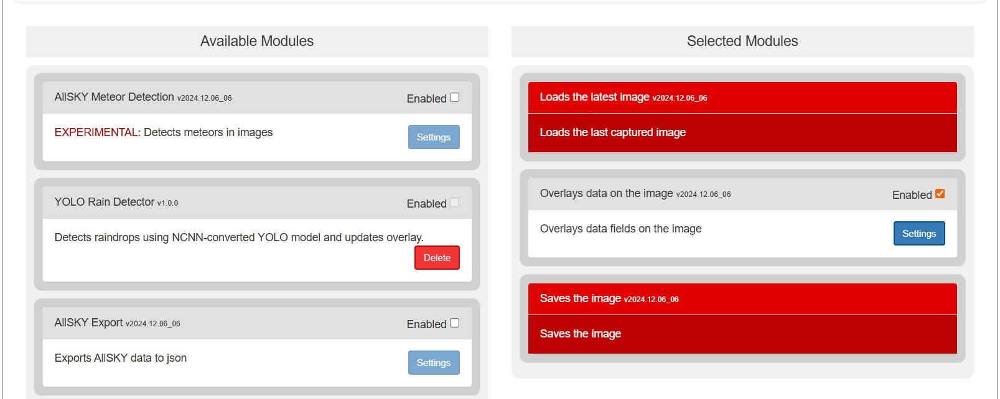

# Allsky YOLO Rain Detector

This repository documents a dissertation project focused on **localised rainfall detection** using an Allsky camera installed at **roof garden of UCL OPS**. The project integrates a custom-trained **YOLOv8n** model to identify raindrops on the camera lens, record the **start of rainfall**, and communicate the result through the Allsky web overlay.

In addition to the detection module, this repo includes the physical **3D-printed enclosure**, **YOLO model in both ultralytics and ncnn format**, and a **fully raindetection module** installable in the Allsky platform.

---

## 📸 Project Context

- **Location**: One Pool Street roof garden, Queen Elizabeth Olympic Park, London
- **Camera**: Rpi HQ
- **Platform** Raspberry Pi 4B
- **Goal**: Detect the **first raindrop** landing on the lens to signal beginning of local rainfall
- **System**: Integrated into the Allsky system and running 24/7 on a Raspberry Pi. 

---

## 🧠 YOLOv8n Raindrop Detection Module

This module is triggered after every image capture in the Allsky system. It runs YOLOv8 object detection on the image, searching for lens raindrops. Once **3 detections within 3 minutes** occur, the module marks this as a rainfall event, records the first raindrop time, and enters a **cooldown period** to avoid redundant detections.

### ✅ Output Variables for Overlay

```json
{
  "AS_YOLORAINDETECTED": True,
  "AS_YOLOFIRSTDROP": "01 Aug 2025, 16:08"
}
```


These are automatically updated and displayed on the Allsky live web UI overlay.

---
## 🛠 Installation

### 🛠 Installation of Allsky


The Allsky System Installation Instructions can be found in the Allsky Team's official documentation at the following URL:
https://htmlpreview.github.io/?https://raw.githubusercontent.com/AllskyTeam/allsky/master/html/documentation/installations/Allsky.html

### 🛠 Installation of this module

This module is designed for Allsky version **v2023.05.01_04** or later. There are currently two installation methods

A: Currently, this function module has been accepted by the Allsky Team into the official Allsky module GitHub repository and can be installed using the official installation method.

B: It can also be installed manually. The instructions are as follows.
#### Installation method for B
##### 1. Clone this repository
```bash
git clone https://github.com/MCH0202/Allsky-raindetector.git
cd allsky-raindetector
```

##### 2. Copy the module to Allsky custom module directory /opt/allsky/modules/
```bash
cp allsky-raindetector/modules/allsky_raindetector/allsky_raindetector.py /opt/allsky/modules/
```

##### 3. Set up Python environment
```bash
source ~/allsky/venv/bin/activate
pip install -r ~/allsky-raindetector/modules/allsky_raindetector/requirements.txt
```

> Ensure `nncn`, `pillow`, and `request` are installed in the allsky venv.

##### 4. Enable the module in Allsky Web UI

After installing the files and dependencies, go to the Allsky web interface:

- Navigate to **Module Manager**
- Drag **YOLO Rain Detector** from the “Available Modules” panel (left) to the “Selected Modules” panel (right)
- Click the **checkbox to enable it**
- Click **Save Modules**

You should see something like this:



### 5. Add overlay variables (optional but recommended)

To display the rain detection status on the Allsky image overlay, add the following lines to your overlay
Once enabled, check the overlay or log output to see if detection is working correctly.

Example output on the image:


---

## 📁 Repository Structure

```
allsky-raindetector/
├── README.md
├── images/                   ← Photos
├── 3d-models/                ← 3D printable enclosure designs
│   └── .STL files
├── modules/                   ← Allsky module files
    └── allsky_raindetector
│       ├── allsky_raindetector.py  ← Main detection script
│       ├── requirements.txt        ← Dependencies
│       └── README.md               ← Module introduction
```
---

## 📦 3D Enclosure

> The 3D-printable STL files are included in `3d-models/`. Designed with Fusion 360, printed in **PLA**. Includes semi-open dome for lens exposure to raindrops.
> The deployment position, and some picture of enclosure in Fusion software and in reality are showed


---

## 📷 Image Samples

> Available under `photos/` folder. Includes system setup and detection result visuals.
> https://raindropcam.co.uk/allsky/


---
